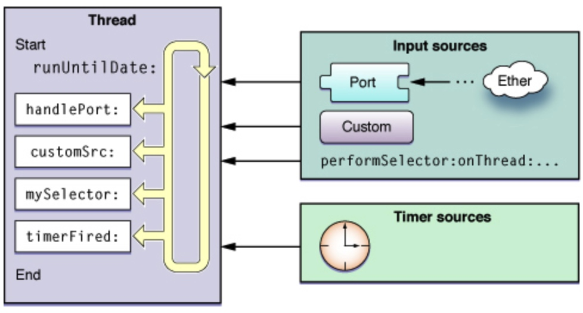
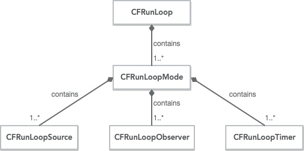

## RunLoop 是什么？

> Run loops are part of the fundamental infrastructure associated with threads. A run loop is an event processing loop that you use to schedule work and coordinate the receipt of incoming events. The purpose of a run loop is to keep your thread busy when there is work to do and put your thread to sleep when there is none.

从定义来看，run loop 是一个循环，跟线程相关。它的作用是保证当有工作时能保证线程繁忙，当没工作时可以让线程进入休眠状态。

在你的应用里面，你不需要去创建 run loop，因为每条线程都会关联一个 run loop。系统会将主线程的 run loop 自动启动，其他线程需要我们手动去启动。

## CFRunLoop

我们在官方文档里可以看到下面这张图：



这张图描述了 run loop 的工作流程。从上图我们大概可以知道 run loop 一直会在处理一些输入源，这些输入源包括 Input sources 和 Timer sources。但是具体是什么机制，还有这些事件源从哪来，我们无从得知。好在 CoreFoundation 框架开源，现在我们结合 CoreFoundation 的源代码来深入理解 run loop 的工作流程。

[CoreFoundation 源码地址](https://opensource.apple.com/tarballs/CF/)

我们都知道 NSFoundation 框架中的 NSRunLoop 是对 CoreFoundation 框架中 CFRunLoop 的封装。

CFRunLoop 的结构体定义如下：

```
struct __CFRunLoop {
    CFRuntimeBase _base;
    pthread_mutex_t _lock;			/* locked for accessing mode list */
    __CFPort _wakeUpPort;			// used for CFRunLoopWakeUp 
    Boolean _unused;
    volatile _per_run_data *_perRunData;              // reset for runs of the run loop
    pthread_t _pthread;
    uint32_t _winthread;
    CFMutableSetRef _commonModes;
    CFMutableSetRef _commonModeItems;
    CFRunLoopModeRef _currentMode;
    CFMutableSetRef _modes;
    struct _block_item *_blocks_head;
    struct _block_item *_blocks_tail;
    CFAbsoluteTime _runTime;
    CFAbsoluteTime _sleepTime;
    CFTypeRef _counterpart;
};
```

从结构体可以看出 CFRunLoop 包含有 `_commonModes`，`_currentMode`，`_modes` 这些我们比较熟悉的成员变量。那到底这些 mode 都是什么呢？

我们来看看 CFRunLoopMode 的结构体：

```
struct __CFRunLoopMode {
    CFRuntimeBase _base;
    pthread_mutex_t _lock;	/* must have the run loop locked before locking this */
    CFStringRef _name;
    Boolean _stopped;
    char _padding[3];
    CFMutableSetRef _sources0;
    CFMutableSetRef _sources1;
    CFMutableArrayRef _observers;
    CFMutableArrayRef _timers;
    CFMutableDictionaryRef _portToV1SourceMap;
    __CFPortSet _portSet;
    CFIndex _observerMask;
#if USE_DISPATCH_SOURCE_FOR_TIMERS
    dispatch_source_t _timerSource;
    dispatch_queue_t _queue;
    Boolean _timerFired; // set to true by the source when a timer has fired
    Boolean _dispatchTimerArmed;
#endif
#if USE_MK_TIMER_TOO
    mach_port_t _timerPort;
    Boolean _mkTimerArmed;
#endif
#if DEPLOYMENT_TARGET_WINDOWS
    DWORD _msgQMask;
    void (*_msgPump)(void);
#endif
    uint64_t _timerSoftDeadline; /* TSR */
    uint64_t _timerHardDeadline; /* TSR */
};
```

从 CFRunLoopMode 的结构体我们可以看出，CFRunLoopMode 用 MutableSet 来维护它自己的 sources0 和 sources1，用 MutableArray 来维护 observers 和 timers。可以理解为 CFRunLoopMode 是这些输入源的管理者，一个 run loop 可以有多个 run loop mode，一个 run loop mode 可以有多个输入源集合。大致关系可以用 UML 类图表示：




我们先来看看什么是 CFRunLoopSource：

```
struct __CFRunLoopSource {
    CFRuntimeBase _base;
    uint32_t _bits;
    pthread_mutex_t _lock;
    CFIndex _order;			/* immutable */
    CFMutableBagRef _runLoops;
    union {
	CFRunLoopSourceContext version0;	/* immutable, except invalidation */
        CFRunLoopSourceContext1 version1;	/* immutable, except invalidation */
    } _context;
};
```

从上述代码我们可以看到 CFRunLoopSource 有两种版本，版本0和版本1，也就是上面我们看到的 source0 和 source1。

根据官方文档的描述，我对 CFRunLoopSource 做了以下总结：
1. CFRunLoopSource 相当于是 run loop 和真实输入源类型对象之间的媒介，CFRunLoopSource 为这些真实输入源服务，监听它们发过来的消息，一旦有消息进来就让 run loop 去处理对应的事件。这些真实输入源类型对象包括 CFMachPort，CFMessagePort，和 CFSocket。
2. CFRunLoopSource 分为两类，一类是版本0，也叫 source0，需要手动去管理，需要先调用 `CFRunLoopSourceSignal` 将 CFRunLoopSource 设置成可触发的，然后再在对应的 run loop 里调用 `CFRunLoopWakeUp` 让 run loop 去处理这个事件。为 CFSocket 服务的 source 就是一个 source0。另一类是版本1，也叫 source1，这类 source 是 run loop 或者内核自己管理的，不需要自己额外处理。为 CFMachPort 和 CFMessagePort 服务的 source 就是 source1。
3. 开发者可以自己创建一个 source，然后将其放进 run loop 里面，CFRunLoopSource 可以帮你生成异步事件，然后让 run loop 去捕捉。例如，可以自定义一个 source 监听网络端口或是某些用户的行为。
4. 一个 CFRunLoopSource 能被同时加入到多个 run loop mode 里面。

对于 CFRunLoopObserver，我们先来看看源码：

```
struct __CFRunLoopObserver {
    CFRuntimeBase _base;
    pthread_mutex_t _lock;
    CFRunLoopRef _runLoop;
    CFIndex _rlCount;
    CFOptionFlags _activities;		/* immutable */
    CFIndex _order;			/* immutable */
    CFRunLoopObserverCallBack _callout;	/* immutable */
    CFRunLoopObserverContext _context;	/* immutable, except invalidation */
};
```

CFRunLoopObserver 相对比较简单，其作用是用来监听某个 run loop 的状态。

Run loop 的状态包括：
1. `kCFRunLoopEntry`：表示 run loop 已经进入了。
2. `kCFRunLoopBeforeTimers`：表示 run loop 将要处理 timer 事件。
3. `kCFRunLoopBeforeSources`：表示 run loop 将要处理 source 事件。
4. `kCFRunLoopBeforeWaiting`：表示 run loop 将要休眠。
5. `kCFRunLoopAfterWaiting`：表示 run loop 被唤醒了。
6. `kCFRunLoopExit`：表示 run loop 退出了。

当 run loop 变成上面某个状态时，会取出当前 mode 的所有 observers，然后根据 observers 的 `_order` 来排序，然后执行 `_callout` 回调给 observers。

最后，我们再来看看 CFRunLoopTimer：

```
struct __CFRunLoopTimer {
    CFRuntimeBase _base;
    uint16_t _bits;
    pthread_mutex_t _lock;
    CFRunLoopRef _runLoop;
    CFMutableSetRef _rlModes;
    CFAbsoluteTime _nextFireDate;
    CFTimeInterval _interval;		/* immutable */
    CFTimeInterval _tolerance;          /* mutable */
    uint64_t _fireTSR;			/* TSR units */
    CFIndex _order;			/* immutable */
    CFRunLoopTimerCallBack _callout;	/* immutable */
    CFRunLoopTimerContext _context;	/* immutable, except invalidation */
};
```

我们发现，CFRunLoopTimer 很多成员变量在 NSTimer 都能看见，这里我也就不多解释了。

由于 CFRunLoopTimer 是 run loop mode 管理的，这就解释了为什么有些情况下 timer 在列表滑动的时候不会响应。原因是列表在滑动的时候，主线程的 run loop 从 DefaultMode 切换到 EventTrackingMode，此时 EventTrackingMode 并没有包含该 timer，也就不会响应 timer 的事件。

## RunLoop 内部机制

到这里，我们已经对 run loop，run loop mode，source，observer 和 timer 有了一定的了解。现在我们开始来了解 run loop 的内部机制，这里我利用 NSRunLoop 的方法作为切入点，进行源码的解析。

### currentRunLoop

我们都知道 `[NSRunLoop currentRunLoop]` 这个方法可以返回当前线程的 run loop。
其实内部调用的是 `CFRunLoopGetCurrent(void)` 这个方法，其定义如下：

```
CFRunLoopRef CFRunLoopGetCurrent(void) {
    CHECK_FOR_FORK();
    CFRunLoopRef rl = (CFRunLoopRef)_CFGetTSD(__CFTSDKeyRunLoop);
    if (rl) return rl;
    return _CFRunLoopGet0(pthread_self());
}
```

`CFRunLoopRef rl = (CFRunLoopRef)_CFGetTSD(__CFTSDKeyRunLoop)` 这里调用了 _CFGetTSD 这个方法，传入的参数 `__CFTSDKeyRunLoop` 是一个枚举值，我们来看看这个方法的定义：

```
// For the use of CF and Foundation only
CF_EXPORT void *_CFGetTSD(uint32_t slot) {
    if (slot > CF_TSD_MAX_SLOTS) {
        _CFLogSimple(kCFLogLevelError, "Error: TSD slot %d out of range (get)", slot);
        HALT;
    }
    __CFTSDTable *table = __CFTSDGetTable();
    if (!table) {
        // Someone is getting TSD during thread destruction. The table is gone, so we can't get any data anymore.
        _CFLogSimple(kCFLogLevelWarning, "Warning: TSD slot %d retrieved but the thread data has already been torn down.", slot);
        return NULL;
    }
    uintptr_t *slots = (uintptr_t *)(table->data);
    return (void *)slots[slot];
}
```

`_CFGetTSD(uint32_t slot)` 这个函数首先会先判断 `slot` 这个枚举值是否越界。然后调用了 `__CFTSDGetTable()` 来获取一个 `__CFTSDTable`。我们来看看 `__CFTSDTable` 的数据结构：

```
// Data structure to hold TSD data, cleanup functions for each
typedef struct __CFTSDTable {
    uint32_t destructorCount;
    uintptr_t data[CF_TSD_MAX_SLOTS];
    tsdDestructor destructors[CF_TSD_MAX_SLOTS];
} __CFTSDTable;
```

可以看出，data 是一个数组，用来存放对象的指针。然后我们来看看 `__CFTSDGetTable()` 做什么：

```
// Get or initialize a thread local storage. It is created on demand.
static __CFTSDTable *__CFTSDGetTable() {
    __CFTSDTable *table = (__CFTSDTable *)__CFTSDGetSpecific();
    // Make sure we're not setting data again after destruction.
    if (table == CF_TSD_BAD_PTR) {
        return NULL;
    }
    // Create table on demand
    if (!table) {
        // This memory is freed in the finalize function
        table = (__CFTSDTable *)calloc(1, sizeof(__CFTSDTable));
        // Windows and Linux have created the table already, we need to initialize it here for other platforms. On Windows, the cleanup function is called by DllMain when a thread exits. On Linux the destructor is set at init time.
#if DEPLOYMENT_TARGET_MACOSX || DEPLOYMENT_TARGET_EMBEDDED || DEPLOYMENT_TARGET_EMBEDDED_MINI
        pthread_key_init_np(CF_TSD_KEY, __CFTSDFinalize);
#endif
        __CFTSDSetSpecific(table);
    }
    
    return table;
}

static void __CFTSDSetSpecific(void *arg) {
#if DEPLOYMENT_TARGET_MACOSX || DEPLOYMENT_TARGET_EMBEDDED || DEPLOYMENT_TARGET_EMBEDDED_MINI
    _pthread_setspecific_direct(CF_TSD_KEY, arg);
#elif DEPLOYMENT_TARGET_LINUX
    pthread_setspecific(__CFTSDIndexKey, arg);
#elif DEPLOYMENT_TARGET_WINDOWS
    TlsSetValue(__CFTSDIndexKey, arg);
#endif
}

static void *__CFTSDGetSpecific() {
#if DEPLOYMENT_TARGET_MACOSX || DEPLOYMENT_TARGET_EMBEDDED || DEPLOYMENT_TARGET_EMBEDDED_MINI
    return _pthread_getspecific_direct(CF_TSD_KEY);
#elif DEPLOYMENT_TARGET_LINUX
    return pthread_getspecific(__CFTSDIndexKey);
#elif DEPLOYMENT_TARGET_WINDOWS
    return TlsGetValue(__CFTSDIndexKey);
#endif
}
```

从上述代码可以看出 `__CFTSDTable` 这个数据结构是来存放跟线程相关的一些对象。`__CFTSDGetTable()` 这个方法会先去跟当前现成要这张数据表，如果当前线程没有，则创建一个新的数据表给它，然后返回这个数据表。

然后我们回过头看 `_CFGetTSD(uint32_t slot)` 这个方法就是用 `slot` 当作 key，在 TSDTable 里面去找对应的对象指针。由于 `slot` 传的是 `__CFTSDKeyRunLoop`，所以这个函数就是返回当前线程的 run loop 对象。

然后再看回 `CFRunLoopGetCurrent(void)` 这个函数，`_CFRunLoopGet0(pthread_self())` 这个函数的定义如下：

```
// should only be called by Foundation
// t==0 is a synonym for "main thread" that always works
CF_EXPORT CFRunLoopRef _CFRunLoopGet0(pthread_t t) {
    if (pthread_equal(t, kNilPthreadT)) {
	t = pthread_main_thread_np();
    }
    __CFLock(&loopsLock);
    if (!__CFRunLoops) {
        __CFUnlock(&loopsLock);
	CFMutableDictionaryRef dict = CFDictionaryCreateMutable(kCFAllocatorSystemDefault, 0, NULL, &kCFTypeDictionaryValueCallBacks);
	CFRunLoopRef mainLoop = __CFRunLoopCreate(pthread_main_thread_np());
	CFDictionarySetValue(dict, pthreadPointer(pthread_main_thread_np()), mainLoop);
	if (!OSAtomicCompareAndSwapPtrBarrier(NULL, dict, (void * volatile *)&__CFRunLoops)) {
	    CFRelease(dict);
	}
	CFRelease(mainLoop);
        __CFLock(&loopsLock);
    }
    CFRunLoopRef loop = (CFRunLoopRef)CFDictionaryGetValue(__CFRunLoops, pthreadPointer(t));
    __CFUnlock(&loopsLock);
    if (!loop) {
	CFRunLoopRef newLoop = __CFRunLoopCreate(t);
        __CFLock(&loopsLock);
	loop = (CFRunLoopRef)CFDictionaryGetValue(__CFRunLoops, pthreadPointer(t));
	if (!loop) {
	    CFDictionarySetValue(__CFRunLoops, pthreadPointer(t), newLoop);
	    loop = newLoop;
	}
        // don't release run loops inside the loopsLock, because CFRunLoopDeallocate may end up taking it
        __CFUnlock(&loopsLock);
	CFRelease(newLoop);
    }
    if (pthread_equal(t, pthread_self())) {
        _CFSetTSD(__CFTSDKeyRunLoop, (void *)loop, NULL);
        if (0 == _CFGetTSD(__CFTSDKeyRunLoopCntr)) {
            _CFSetTSD(__CFTSDKeyRunLoopCntr, (void *)(PTHREAD_DESTRUCTOR_ITERATIONS-1), (void (*)(void *))__CFFinalizeRunLoop);
        }
    }
    return loop;
}
```

这里面 `__CFRunLoops` 是一个 `CFMutableDictionaryRef`，也就是一个字典，key 是 线程的指针，value 是该线程的 run loop。`_CFRunLoopGet0(pthread_t t)` 这个函数会先判断 `__CFRunLoops` 存不存在，如果不存在，则创建 `__CFRunLoops`，并且创建一个 run loop 给主线程，然后将这个 main run loop 加到 `__CFRunLoops` 里面。

其中 `t` 指的是线程，该函数首先会从 `__CFRunLoops` 查找 `t` 对应的 run loop，如果没有，就创建一个新的 run loop 然后加到 `__CFRunLoops` 里面，如果 `t` 刚好也是当前线程的话，就将这个 run loop 加到当前线程的 TSDTable 中。

综上所述，`[NSRunLoop currentRunLoop]` 会先找当前线程的 run loop，找不到的话就创建一个新的 run loop 赋予当前线程。所以我们不需要自己手动创建 run loop。

### mainRunLoop

`CFRunLoopGetMain(void)` 源码如下：

```
CFRunLoopRef CFRunLoopGetMain(void) {
    CHECK_FOR_FORK();
    static CFRunLoopRef __main = NULL; // no retain needed
    if (!__main) __main = _CFRunLoopGet0(pthread_main_thread_np()); // no CAS needed
    return __main;
}
```

这里稍微跟 `CFRunLoopGetCurrent(void)` 有点不同的是，这里没有去查线程的 TSDTable，因为这个方要返回的是主线程的 run loop，main run loop 对象在 `__CFRunLoops` 这个字典里就可以直接找到，所以直接调 `_CFRunLoopGet0(pthread_main_thread_np())` 就可以了。

### currentMode

从 CFRunLoop 的结构体我们可以知道，通过成员变量 `_currentMode` 可以直接获取。

### - run

我们都知道 run 一个 NSRunLoop 有以下几种方法：
1. - run
2. - runMode:beforeDate:
3. - runUntilDate:
4. - acceptInputForMode:beforeDate:

这几个方法跟 run loop mode 和时间有关系，我们来看看 CFRunLoop 的源码：

```
void CFRunLoopRun(void) {	/* DOES CALLOUT */
    int32_t result;
    do {
        result = CFRunLoopRunSpecific(CFRunLoopGetCurrent(), kCFRunLoopDefaultMode, 1.0e10, false);
        CHECK_FOR_FORK();
    } while (kCFRunLoopRunStopped != result && kCFRunLoopRunFinished != result);
}

SInt32 CFRunLoopRunInMode(CFStringRef modeName, CFTimeInterval seconds, Boolean returnAfterSourceHandled) {     /* DOES CALLOUT */
    CHECK_FOR_FORK();
    return CFRunLoopRunSpecific(CFRunLoopGetCurrent(), modeName, seconds, returnAfterSourceHandled);
}
```

我们可以看到，无论是 `CFRunLoopRun` 或 `CFRunLoopRunInMode` 都会调用到 `CFRunLoopRunSpecific` 这个函数，我们来看看这个函数：

```
SInt32 CFRunLoopRunSpecific(CFRunLoopRef rl, CFStringRef modeName, CFTimeInterval seconds, Boolean returnAfterSourceHandled) {     /* DOES CALLOUT */
    CHECK_FOR_FORK();
    if (__CFRunLoopIsDeallocating(rl)) return kCFRunLoopRunFinished;
    __CFRunLoopLock(rl);
    CFRunLoopModeRef currentMode = __CFRunLoopFindMode(rl, modeName, false);
    if (NULL == currentMode || __CFRunLoopModeIsEmpty(rl, currentMode, rl->_currentMode)) {
	Boolean did = false;
	if (currentMode) __CFRunLoopModeUnlock(currentMode);
	__CFRunLoopUnlock(rl);
	return did ? kCFRunLoopRunHandledSource : kCFRunLoopRunFinished;
    }
    volatile _per_run_data *previousPerRun = __CFRunLoopPushPerRunData(rl);
    CFRunLoopModeRef previousMode = rl->_currentMode;
    rl->_currentMode = currentMode;
    int32_t result = kCFRunLoopRunFinished;

	if (currentMode->_observerMask & kCFRunLoopEntry ) __CFRunLoopDoObservers(rl, currentMode, kCFRunLoopEntry);
	result = __CFRunLoopRun(rl, currentMode, seconds, returnAfterSourceHandled, previousMode);
	if (currentMode->_observerMask & kCFRunLoopExit ) __CFRunLoopDoObservers(rl, currentMode, kCFRunLoopExit);

        __CFRunLoopModeUnlock(currentMode);
        __CFRunLoopPopPerRunData(rl, previousPerRun);
	rl->_currentMode = previousMode;
    __CFRunLoopUnlock(rl);
    return result;
}
```

其中参数：
* rl：run loop 对象。
* modeName：run loop mode 的名字。
* seconds：要让这个 run loop 运行的时间。
* returnAfterSourceHandled：这个布尔值如果是 true，则表示每次循环只处理一个 source0。

这个函数会先用 modeName 去找 rl 里面是否有这个 mode，如果没有这个 mode 或者这个 mode 为空（没有 source0，source1，timers 和 blocks）则直接返回 `kCFRunLoopRunFinished`。

如果这个 mode 存在，则会先通知 mode 里面所有 observers 这个 run loop 已经进入了（`kCFRunLoopEntry`）。然后调用 `__CFRunLoopRun(rl, currentMode, seconds, returnAfterSourceHandled, previousMode)`。跑完之后通知 mode 里面所有 observers 这个 run loop 已经进入了退出了（`kCFRunLoopExit`）。最后将 run loop 的 `_currentMode` 设置为之前的 mode。

从上面代码我们可以看出，`CFRunLoopRun` 默认使用的是 `kCFRunLoopDefaultMode`。

然后我们再来看看 `__CFRunLoopRun` 这个函数，这个函数可以说是最核心的函数，这个函数有点长，我先用伪代码表示一下：

```
static int32_t __CFRunLoopRun(CFRunLoopRef rl, CFRunLoopModeRef rlm, CFTimeInterval seconds, Boolean stopAfterHandle, CFRunLoopModeRef previousMode) {
    
    dispatch_source_t timeout_timer = dispatch_source_create(DISPATCH_SOURCE_TYPE_TIMER);
    
    do {
        __CFRunLoopDoObservers(kCFRunLoopBeforeTimers);
        __CFRunLoopDoObservers(kCFRunLoopBeforeSources);
        
        __CFRunLoopDoBlocks();
        
        __CFRunLoopDoSources0();
        
        if (thereIsMessageFromDispatchPort()) {
            goto hanle_msg;
        }
        
        __CFRunLoopDoObservers(kCFRunLoopBeforeWaiting);
        __CFRunLoopSetSleeping(rl);
        
        wait {
            // Zzz...
        } until (messageFrom(waitSet)) {
            // wake up
            __CFRunLoopUnsetSleeping(rl);
            __CFRunLoopDoObservers(kCFRunLoopAfterWaiting);
            
            hanle_msg:;
            if (livePort == modeQueuePort) {
                __CFRunLoopDoTimers();
            } else if (livePort == _timerPort) {
                __CFRunLoopDoTimers();
            } else if (livePort == dispatchPort) {
                __CFRUNLOOP_IS_SERVICING_THE_MAIN_DISPATCH_QUEUE__(msg);
            } else {
                __CFRunLoopDoSource1();
            }
            
            __CFRunLoopDoBlocks();
        }
    } while (!stop && !timeout);
}
```

首先，会创建一个 GCD 的 timer 来检查这个 run loop 是否过期，具体源码如下：

```
dispatch_source_t timeout_timer = NULL;
    struct __timeout_context *timeout_context = (struct __timeout_context *)malloc(sizeof(*timeout_context));
    if (seconds <= 0.0) { // instant timeout
        seconds = 0.0;
        timeout_context->termTSR = 0ULL;
    } else if (seconds <= TIMER_INTERVAL_LIMIT) {
	dispatch_queue_t queue = pthread_main_np() ? __CFDispatchQueueGetGenericMatchingMain() : __CFDispatchQueueGetGenericBackground();
	timeout_timer = dispatch_source_create(DISPATCH_SOURCE_TYPE_TIMER, 0, 0, queue);
        dispatch_retain(timeout_timer);
	timeout_context->ds = timeout_timer;
	timeout_context->rl = (CFRunLoopRef)CFRetain(rl);
	timeout_context->termTSR = startTSR + __CFTimeIntervalToTSR(seconds);
	dispatch_set_context(timeout_timer, timeout_context); // source gets ownership of context
	dispatch_source_set_event_handler_f(timeout_timer, __CFRunLoopTimeout);
        dispatch_source_set_cancel_handler_f(timeout_timer, __CFRunLoopTimeoutCancel);
        uint64_t ns_at = (uint64_t)((__CFTSRToTimeInterval(startTSR) + seconds) * 1000000000ULL);
        dispatch_source_set_timer(timeout_timer, dispatch_time(1, ns_at), DISPATCH_TIME_FOREVER, 1000ULL);
        dispatch_resume(timeout_timer);
    } else { // infinite timeout
        seconds = 9999999999.0;
        timeout_context->termTSR = UINT64_MAX;
    }
```

从上面我们可以看出，如果不设置过期时间的话，这个过期时间默认会很大，也就说这个 run loop 基本不会因为过期被退出。

接着就进入 do-while 循环了，我们先来看看 run loop 在休眠之前都干了什么：

```
do {
    // ignore some source code here...
    
    __CFPortSet waitSet = rlm->_portSet;
    
    __CFRunLoopUnsetIgnoreWakeUps(rl);
    
    if (rlm->_observerMask & kCFRunLoopBeforeTimers) __CFRunLoopDoObservers(rl, rlm, kCFRunLoopBeforeTimers);
    if (rlm->_observerMask & kCFRunLoopBeforeSources) __CFRunLoopDoObservers(rl, rlm, kCFRunLoopBeforeSources);
            
    __CFRunLoopDoBlocks(rl, rlm);
            
    Boolean sourceHandledThisLoop = __CFRunLoopDoSources0(rl, rlm, stopAfterHandle);
    if (sourceHandledThisLoop) {
        __CFRunLoopDoBlocks(rl, rlm);
    }
    
    Boolean poll = sourceHandledThisLoop || (0ULL == timeout_context->termTSR);
    
    if (MACH_PORT_NULL != dispatchPort && !didDispatchPortLastTime) {
        msg = (mach_msg_header_t *)msg_buffer;
        if (__CFRunLoopServiceMachPort(dispatchPort, &msg, sizeof(msg_buffer), &livePort, 0, &voucherState, NULL)) {
            goto handle_msg;
        }
    }
    
    didDispatchPortLastTime = false;
    
    if (!poll && (rlm->_observerMask & kCFRunLoopBeforeWaiting)) __CFRunLoopDoObservers(rl, rlm, kCFRunLoopBeforeWaiting);
        __CFRunLoopSetSleeping(rl);
        // do not do any user callouts after this point (after notifying of sleeping)
        
        // Must push the local-to-this-activation ports in on every loop
        // iteration, as this mode could be run re-entrantly and we don't
        // want these ports to get serviced.
        
        __CFPortSetInsert(dispatchPort, waitSet);
        
        __CFRunLoopModeUnlock(rlm);
        __CFRunLoopUnlock(rl);
        
        CFAbsoluteTime sleepStart = poll ? 0.0 : CFAbsoluteTimeGetCurrent();
        
#if USE_DISPATCH_SOURCE_FOR_TIMERS
        do {
            if (kCFUseCollectableAllocator) {
                // objc_clear_stack(0);
                // <rdar://problem/16393959>
                memset(msg_buffer, 0, sizeof(msg_buffer));
            }
            msg = (mach_msg_header_t *)msg_buffer;
            
            __CFRunLoopServiceMachPort(waitSet, &msg, sizeof(msg_buffer), &livePort, poll ? 0 : TIMEOUT_INFINITY, &voucherState, &voucherCopy);
            
            if (modeQueuePort != MACH_PORT_NULL && livePort == modeQueuePort) {
                // Drain the internal queue. If one of the callout blocks sets the timerFired flag, break out and service the timer.
                while (_dispatch_runloop_root_queue_perform_4CF(rlm->_queue));
                if (rlm->_timerFired) {
                    // Leave livePort as the queue port, and service timers below
                    rlm->_timerFired = false;
                    break;
                } else {
                    if (msg && msg != (mach_msg_header_t *)msg_buffer) free(msg);
                }
            } else {
                // Go ahead and leave the inner loop.
                break;
            }
        } while (1);
#else
        if (kCFUseCollectableAllocator) {
            // objc_clear_stack(0);
            // <rdar://problem/16393959>
            memset(msg_buffer, 0, sizeof(msg_buffer));
        }
    msg = (mach_msg_header_t *)msg_buffer;
    __CFRunLoopServiceMachPort(waitSet, &msg, sizeof(msg_buffer), &livePort, poll ? 0 : TIMEOUT_INFINITY, &voucherState, &voucherCopy);
    
    // run loop will be stuck here if no message comes from waitSet.
    //
    // Zzz...
    //
    // keep runing here if there is message comes from waitSet.
}
```

上面源码经历下面几个步骤：
1. 先将 run loop mode 监听的端口集合当作 waitSet。
2. 将 run loop 设置成可唤醒。
3. 通知 run loop mode 里面的 observers 即将要处理 timers（kCFRunLoopBeforeTimers）。
4. 通知 run loop mode 里面的 observers 即将要处理 sources（kCFRunLoopBeforeTimers）。
5. 执行 run loop 中的 blocks，这些 blocks 可以通过 `CFRunLoopPerformBlock()` 这个方法加到 run loop 中。
6. 处理 source0 的事件。
7. 检查是否有 GCD 派发到主线程的任务，有的话就直接跳到处理消息环节。
8. 通知 run loop mode 里面的 observers 即将要休眠（kCFRunLoopBeforeWaiting）。
9. 将 run loop 的状态设置成 sleeping，此时无法处理任何用户事件。
10. 将 GCD 主线程端口加到 waitSet 里面。
11. 调用 `__CFRunLoopServiceMachPort()` 函数，等待事件的消息。这里内部有个 `for(;;)` 死循环，程序会一直在这里卡着，直到 waitSet 里任何一个端口给 run loop 发消息，这时会调用 `CFRUNLOOP_WAKEUP()` 将 run loop 唤醒。

我们继续看接下来的源码：

```
__CFRunLoopLock(rl);
    __CFRunLoopModeLock(rlm);
    
    rl->_sleepTime += (poll ? 0.0 : (CFAbsoluteTimeGetCurrent() - sleepStart));
    
    // Must remove the local-to-this-activation ports in on every loop
    // iteration, as this mode could be run re-entrantly and we don't
    // want these ports to get serviced. Also, we don't want them left
    // in there if this function returns.
    
    __CFPortSetRemove(dispatchPort, waitSet);
    
    __CFRunLoopSetIgnoreWakeUps(rl);
    
    // user callouts now OK again
    __CFRunLoopUnsetSleeping(rl);
    if (!poll && (rlm->_observerMask & kCFRunLoopAfterWaiting)) __CFRunLoopDoObservers(rl, rlm, kCFRunLoopAfterWaiting);
        
        handle_msg:;
    __CFRunLoopSetIgnoreWakeUps(rl);
    
    if (MACH_PORT_NULL == livePort) {
        CFRUNLOOP_WAKEUP_FOR_NOTHING();
        // handle nothing
    } else if (livePort == rl->_wakeUpPort) {
        CFRUNLOOP_WAKEUP_FOR_WAKEUP();
    }
#if USE_DISPATCH_SOURCE_FOR_TIMERS
    else if (modeQueuePort != MACH_PORT_NULL && livePort == modeQueuePort) {
        CFRUNLOOP_WAKEUP_FOR_TIMER();
        if (!__CFRunLoopDoTimers(rl, rlm, mach_absolute_time())) {
            // Re-arm the next timer, because we apparently fired early
            __CFArmNextTimerInMode(rlm, rl);
        }
    }
#endif
#if USE_MK_TIMER_TOO
    else if (rlm->_timerPort != MACH_PORT_NULL && livePort == rlm->_timerPort) {
        CFRUNLOOP_WAKEUP_FOR_TIMER();
        // On Windows, we have observed an issue where the timer port is set before the time which we requested it to be set. For example, we set the fire time to be TSR 167646765860, but it is actually observed firing at TSR 167646764145, which is 1715 ticks early. The result is that, when __CFRunLoopDoTimers checks to see if any of the run loop timers should be firing, it appears to be 'too early' for the next timer, and no timers are handled.
        // In this case, the timer port has been automatically reset (since it was returned from MsgWaitForMultipleObjectsEx), and if we do not re-arm it, then no timers will ever be serviced again unless something adjusts the timer list (e.g. adding or removing timers). The fix for the issue is to reset the timer here if CFRunLoopDoTimers did not handle a timer itself. 9308754
        if (!__CFRunLoopDoTimers(rl, rlm, mach_absolute_time())) {
            // Re-arm the next timer
            __CFArmNextTimerInMode(rlm, rl);
        }
    }
#endif
    else if (livePort == dispatchPort) {
        CFRUNLOOP_WAKEUP_FOR_DISPATCH();
        __CFRunLoopModeUnlock(rlm);
        __CFRunLoopUnlock(rl);
        _CFSetTSD(__CFTSDKeyIsInGCDMainQ, (void *)6, NULL);
#if DEPLOYMENT_TARGET_WINDOWS
        void *msg = 0;
#endif
        __CFRUNLOOP_IS_SERVICING_THE_MAIN_DISPATCH_QUEUE__(msg);
        _CFSetTSD(__CFTSDKeyIsInGCDMainQ, (void *)0, NULL);
        __CFRunLoopLock(rl);
        __CFRunLoopModeLock(rlm);
        sourceHandledThisLoop = true;
        didDispatchPortLastTime = true;
    } else {
        CFRUNLOOP_WAKEUP_FOR_SOURCE();
        
        // If we received a voucher from this mach_msg, then put a copy of the new voucher into TSD. CFMachPortBoost will look in the TSD for the voucher. By using the value in the TSD we tie the CFMachPortBoost to this received mach_msg explicitly without a chance for anything in between the two pieces of code to set the voucher again.
        voucher_t previousVoucher = _CFSetTSD(__CFTSDKeyMachMessageHasVoucher, (void *)voucherCopy, os_release);
        
        // Despite the name, this works for windows handles as well
        CFRunLoopSourceRef rls = __CFRunLoopModeFindSourceForMachPort(rl, rlm, livePort);
        if (rls) {
#if DEPLOYMENT_TARGET_MACOSX || DEPLOYMENT_TARGET_EMBEDDED || DEPLOYMENT_TARGET_EMBEDDED_MINI
            mach_msg_header_t *reply = NULL;
            sourceHandledThisLoop = __CFRunLoopDoSource1(rl, rlm, rls, msg, msg->msgh_size, &reply) || sourceHandledThisLoop;
            if (NULL != reply) {
                (void)mach_msg(reply, MACH_SEND_MSG, reply->msgh_size, 0, MACH_PORT_NULL, 0, MACH_PORT_NULL);
                CFAllocatorDeallocate(kCFAllocatorSystemDefault, reply);
            }
            //#elif DEPLOYMENT_TARGET_WINDOWS
            //                sourceHandledThisLoop = __CFRunLoopDoSource1(rl, rlm, rls) || sourceHandledThisLoop;
            //#endif
        }
        
        // Restore the previous voucher
        _CFSetTSD(__CFTSDKeyMachMessageHasVoucher, previousVoucher, os_release);
        
    }
#if DEPLOYMENT_TARGET_MACOSX || DEPLOYMENT_TARGET_EMBEDDED || DEPLOYMENT_TARGET_EMBEDDED_MINI
    if (msg && msg != (mach_msg_header_t *)msg_buffer) free(msg);
#endif
        
        __CFRunLoopDoBlocks(rl, rlm);
        
        
        if (sourceHandledThisLoop && stopAfterHandle) {
            retVal = kCFRunLoopRunHandledSource;
        } else if (timeout_context->termTSR < mach_absolute_time()) {
            retVal = kCFRunLoopRunTimedOut;
        } else if (__CFRunLoopIsStopped(rl)) {
            __CFRunLoopUnsetStopped(rl);
            retVal = kCFRunLoopRunStopped;
        } else if (rlm->_stopped) {
            rlm->_stopped = false;
            retVal = kCFRunLoopRunStopped;
        } else if (__CFRunLoopModeIsEmpty(rl, rlm, previousMode)) {
            retVal = kCFRunLoopRunFinished;
        }
    
#if DEPLOYMENT_TARGET_MACOSX || DEPLOYMENT_TARGET_EMBEDDED || DEPLOYMENT_TARGET_EMBEDDED_MINI
    voucher_mach_msg_revert(voucherState);
    os_release(voucherCopy);
#endif
    
} while (0 == retVal);

if (timeout_timer) {
    dispatch_source_cancel(timeout_timer);
    dispatch_release(timeout_timer);
} else {
    free(timeout_context);
}

return retVal;
```

当 run loop 接收到 waitSet 里面任何一个端口发来的消息之后，上面的代码才开始执行：
1. 将 GCD 主线程的端口从 waitSet 里面移除。
2. 将 run loop 设置成不可被唤醒。
3. 将 run loop 状态设置成非 sleeping。此时可以处理用户事件了。
4. 通知 run loop mode 里面的 observers 当前已经被唤醒了（kCFRunLoopAfterWaiting）。
5. 开始进入处理消息流程，这里会判断唤醒 run loop 的端口 `livePort`。
6. 如果 `livePort` 是空，则什么事情都不干。
7. 如果 `livePort` 是 `_wakeUpPort`，也什么事情都不干。这里一般是调用 `CFRunLoopWakeUp()` 这个方法，将 run loop 手动唤醒，一般跟 `CFRunLoopPerformBlock()` 一起使用。
8. 如果 `livePort` 是 `modeQueuePort`，则处理 GCD timer 的事件。
9. 如果 `livePort` 是 `_timerPort`，则处理正常 timer 的事件。
10. 如果 `livePort` 是 `dispatchPort`，则处理 GCD 派发给主线程的任务。
11. 如果都不是，则处理 source1 的事件。
12. 处理 run loop 中的 blocks。
13. 判断 run loop 的状态以及是否过期，如果 run loop 被停止了或者过期了，则跳出循环，否则继续循环。

## 总结

以上就是我对 CFRunLoop 源代码的理解，如果你觉得有地方描述有误，欢迎指出，谢谢！

## 参考

* [Run Loops](https://developer.apple.com/library/archive/documentation/Cocoa/Conceptual/Multithreading/RunLoopManagement/RunLoopManagement.html)
* [CoreFoundation 源码](https://opensource.apple.com/tarballs/CF/)